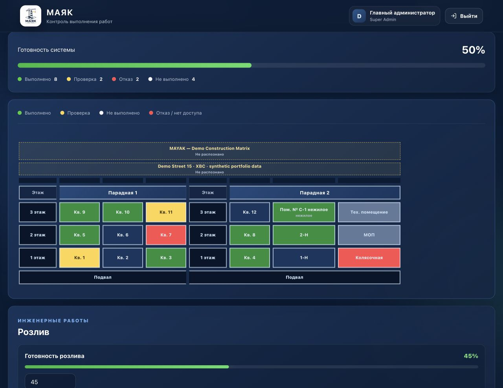

<p align="center">
  
</p>

<h1 align="center">MAYAK — контроль строительной готовности</h1>

<p align="center">
  Рабочая веб-система для контроля инженерных работ по объектам, системам, помещениям и подрядчикам.
</p>

<p align="center">
  <a href="README.md">English</a> · <strong>Русский</strong>
</p>

> Это очищенная portfolio-версия проекта. Она содержит только синтетические demo-данные и новые скриншоты локального demo-окружения. Production-история, конфигурация и данные заказчика остаются приватными.

## Что делает MAYAK

MAYAK объединяет заказчика и подрядчиков в одном операционном контуре. Готовность отслеживается по подрядчику, объекту, инженерной системе и помещению с учётом ролей и разрешений.

- **Шахматка строительной готовности** — интерактивная матрица помещений со статусами «выполнено», «проверка», «отказ» и «не выполнено».
- **Универсальный импортёр Excel** — сохраняет геометрию листа, объединённые ячейки, парадные, этажи, квартиры и нежилые помещения; перед записью доступен preview.
- **Ролевой доступ** — отдельные права Super Admin, заказчика/администратора и подрядчика.
- **Фотоподтверждение** — UUID-имена файлов, связь с помещениями и общими работами, rollback файлов при ошибке записи JSON.
- **Готовность объекта** — живая сводка, процент выполнения и распределение по статусам.
- **Розлив** — прогресс одиночной, верхней и нижней разводки.
- **PDF-отчёты** — печатная сводка по объекту и инженерной системе.

## Скриншоты

Все изображения получены в локальном очищенном окружении. Названия, адреса, помещения и показатели прогресса являются синтетическими.

### Dashboard


### Шахматка строительной готовности



### Универсальный импорт Excel


### Карточка помещения


### Готовность объекта


### Мобильный dashboard

<p align="center">
  
</p>

## Стабильность production / Нагрузочное тестирование

Во время production-нагрузочного тестирования была выявлена критическая race condition цикла read-modify-write JSON между тремя Gunicorn workers. Исправление использует межпроцессную блокировку `fcntl.flock`, повторное чтение актуального JSON после получения lock и атомарную запись во временный файл с `flush`, `fsync` и `os.replace()`.

Результаты после исправления:

| Сценарий | Результат |
| --- | --- |
| 20 конкурентных записей × 5 серий | **100/100 сохранено**, **0 потерянных обновлений** |
| 50 конкурентных записей × 5 серий | **250/250 сохранено**, **0 потерянных обновлений** |
| 5 / 10 / 20 / 50 одновременных загрузок фото | Все файлы и JSON-ссылки сохранены; **0 orphan**, **0 повреждённых** |
| 50 конкурентных смешанных операций | **50/50 успешно**, **0 потерянных обновлений** |
| Read-only HTTPS, 50 одновременных пользователей | **0 ошибок**; p95 **411 мс**, p99 **570 мс**, max **724 мс** |
| Запись, 50 конкурентных операций | p95 **120,9 мс**, p99 **128,3 мс**, max **129,9 мс** |

**PASS — конкурентная запись JSON исправлена**

**В рамках протестированной нагрузки MAYAK безопасно работает при 50 одновременно активных пользователях.** Это не является заявлением о неограниченном масштабировании и не подтверждает нагрузки или сценарии за пределами перечисленных тестов.

Файловая блокировка сериализует записи, а одновременные изменения одного помещения используют семантику last-write-wins. JSON остаётся текущим пределом масштабирования. При существенном росте объёма данных или частоты записи следующим архитектурным шагом должна стать транзакционная БД, например PostgreSQL.

## Архитектура безопасности

- Секрет Flask-сессий поступает из runtime environment; без обязательной переменной приложение прекращает запуск.
- Аутентификация работает только по password hash через Werkzeug; plaintext fallback и встроенных credentials нет.
- Изменения пользователей и business-данных используют межпроцессный lock, reread-after-lock и атомарную замену файла.
- Runtime JSON, uploads, environment-файлы, отчёты, caches и архивы исключены из Git.
- Пароли demo-аккаунтов вводятся локально через `getpass` и отсутствуют в репозитории.

## Технологии

- Python, Flask, Werkzeug и Gunicorn
- Jinja2, HTML, CSS и vanilla JavaScript
- OpenPyXL для импорта Excel с сохранением структуры
- ReportLab для PDF-отчётов
- JSON persistence с межпроцессной блокировкой `fcntl` и атомарной заменой файлов

## Локальный demo-запуск

Текущий механизм блокировки использует `fcntl`, поэтому demo рассчитано на Linux или macOS.

```bash
git clone https://github.com/NiksTiks-code/mayak-control-public.git
cd mayak-control-public

python3 -m venv .venv
source .venv/bin/activate
pip install -r requirements.txt

python scripts/init_demo.py
export MAYAK_SECRET_KEY="$(python -c 'import secrets; print(secrets.token_urlsafe(48))')"
python app.py
```

Откройте `http://127.0.0.1:5001`. Инициализатор скрыто запрашивает новые пароли для `demo_admin` и `demo_contractor`. Пароля по умолчанию нет.

В репозитории также находится [`demo/mayak_demo_import.xlsx`](demo/mayak_demo_import.xlsx) — синтетическая книга с парадными, этажами, квартирами, нежилыми помещениями, объединёнными ячейками и сохранённой геометрией.

## Состав репозитория

```text
app.py                         Flask-приложение и безопасные JSON write-paths
excel_importer.py              Импортёр Excel с сохранением структуры
templates/                     Пользовательский интерфейс Jinja2
static/                        CSS, JavaScript и фирменная графика MAYAK
demo/                          Синтетические JSON-примеры и demo workbook
docs/screenshots/              Очищенные скриншоты локального demo
scripts/init_demo.py           Интерактивная инициализация demo
.env.example                   Только названия environment variables
```
